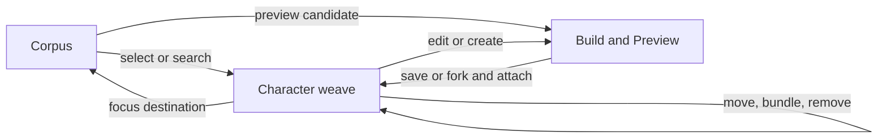

# Character sheet aesthetic and editing rebuild plan

This plan implements the contract in [`docs/design/swordweave-aesthetic-system.md`](../design/swordweave-aesthetic-system.md). No further character-sheet visual patch should bypass the shared components defined here.

## Current failures and root causes

### Primitive typography

The visible Markdown paragraph is a child of `.v12-rule-description`. The broad legacy selector `.v12-expression-rule p` applies 12px copper directly to that child, while the correction targeted its wrapper. Browser inspection confirms every affected nested narrative paragraph is currently 12px copper.

### Drawer

The drawer is styled as a collection of generic bordered cards. Local gradients and borders do not create a unified chassis. Practice rows are over-boxed, and the material hierarchy does not match Atelier or Library.

### Modals

The app has several independent shells: `DetailModal`, `WorkspaceSurface`, `ModalStack`, formula modals, and the Build/Preview drawer. They use different headers, widths, spacing, and bodies. Primitive preview happens to look correct because its content component is mature; the other entity previews expose the inconsistency.

### Character Library and edit mode

`WorkspaceLibraryPicker` is a separate simplified Library implementation. Character editing presents commands, browser, composition, and preview as disconnected disclosures. The Build/Preview flow exists globally but is not a visible, understandable part of the edit workspace.

## Character Atelier product model

Edit mode becomes a persistent workspace within the character sheet. It is not a modal launched for each command and it does not depend on the global FAB.



### Desktop composition

The workspace follows the same three-part apparatus as Atelier:

| Zone | Purpose | Existing production source |
| --- | --- | --- |
| **Corpus** | Search the current character or the shared Library | `LibraryMarketRail`, `LibraryToolbar`, `LibraryTable`, character workspace graph |
| **Character weave** | Inspect and change the selected character container and its ordered contents | `CharacterWorkspace`, workspace graph commands, bundle preview APIs |
| **Build & Preview** | Author or edit a definition and see the global preview live | sandbox forms, form previews, `EntityPreview`, current drawer slot contract |

The zones are resizable on wide desktop, like the Library workbench. At narrower desktop widths the right zone becomes a tabbed side sheet. The selected entity and destination survive layout changes.

```text
┌ CHARACTER EDITING ─ Tessy3 ───────────────────────────────────────────────┐
│ Destination  Manifest › Mystic › Greater Invisibility    8 BU available │
├──────────────────────┬──────────────────────────┬─────────────────────────┤
│ CORPUS               │ CHARACTER WEAVE          │ BUILD & PREVIEW         │
│ Character | Library  │ focused container        │ Preview | Build         │
│ search + filters     │ ordered composition      │ canonical entity view   │
│ canonical rows       │ add / move / remove      │ real Atelier form       │
│                      │ bundle / update          │ validation + save review│
└──────────────────────┴──────────────────────────┴─────────────────────────┘
```

The center is the authority for destination and structure. The left supplies candidates. The right explains or authors the selected thing. This prevents the current failure where a Library list, an add dropdown, a modal, and a hidden drawer each own a different fragment of the same task.

### Mobile composition

Mobile presents one zone at a time through three persistent tabs:

1. **Corpus**
2. **Character**
3. **Build / Preview**

The destination bar remains visible above the tabs. Back navigation returns to the previous zone without clearing the selected candidate, draft, or destination.

### Persistent destination bar

Every mutation is anchored by a destination bar:

```text
ADDING TO   Tessy3 › Manifest › Mystic › Greater Invisibility
```

The bar provides:

- destination breadcrumb;
- accepted entity kinds;
- expected BU change;
- change-destination action;
- clear action.

When there is only one valid destination, it is selected automatically and remains visible. When there are multiple valid destinations, the user chooses from the character graph. There is no ambiguous `Add to this…` dropdown.

### Workspace state

The UI should model the edit session explicitly:

```ts
type CharacterEditSession = {
  source: "character" | "library";
  focusedEntity: EntityKey | "character-root";
  destination: EntityKey | "character-root" | null;
  selectedCandidates: EntityKey[];
  activePane: "corpus" | "character" | "build" | "preview";
  draft: { kind: EntityKind; sourceKey?: EntityKey } | null;
  preview: EntityKey | "draft" | null;
  pendingCommand: WorkspaceCommand | null;
};
```

This session belongs to the character workspace. It must not be inferred from whichever modal happens to be open.

## Edit-mode command model

### Browse and inspect

- Clicking a character piece focuses it in Character weave and opens its read-only preview in the right zone.
- Clicking a Library entry selects it and shows the production Library preview in the right zone.
- Nested pieces can be inspected through the global preview stack without changing the destination.
- Previewing never mutates the character.

### Add existing content

1. Select a destination in Character weave.
2. Select one or more compatible entries from Corpus.
3. Review exact version, provenance, mirror state, and BU delta.
4. Choose **Add to [destination name]**.
5. Apply the existing `add-reference` command and keep an Undo receipt visible.

Incompatible entries remain visible but explain why they cannot be added to the selected destination.

### Create new content

1. Choose **Create** from the destination bar or empty slot.
2. Show only kinds accepted by that destination.
3. Open the real Atelier form in the Build pane.
4. Update the Preview pane continuously through the existing form-preview contract.
5. Save the definition and attach it to the destination in one reviewed transaction.

The form uses the same authoring tabs, rules guide, Library corpus, slotting behavior, and validation as Atelier.

### Fork from Library

1. Preview the Library definition.
2. Choose **Fork and add to [destination]**.
3. Open the fork in Build with provenance preserved.
4. Save and attach the fork.

The user may also choose **Add exact version** when no customization is needed.

### Edit a definition

- Owned definitions open directly in Build.
- Borrowed or system definitions state that editing creates a fork.
- The Preview pane displays the draft while the character continues using the saved version.
- Save review lists definition changes, affected character references, BU delta, and whether the character reference will advance to the new version.
- **Edit in Atelier** opens the full-page Atelier with the same entity and draft context when more room is desired.

### Bundle existing character pieces

1. Enable selection mode in Character weave.
2. Select compatible direct or referenced pieces.
3. Choose **Bundle as capability**, **Bundle as effect**, **Bundle as heritage**, or **Bundle as item**, according to containment rules.
4. Open the real form in Build with the selected pieces pre-slotted.
5. Preview, save, and review whether direct supplies are retained or adopted by the new bundle.

### Move and reorder

- Drag and drop remains available on pointer devices.
- Every draggable action has an equivalent **Move to…** command.
- The destination preview identifies whether the operation moves a reference, adopts a direct supply, or creates an additional reference.
- Reordering within a bundle is handled directly in Character weave and reflected immediately in Preview.

### Remove

- **Remove from [bundle]** applies `remove-reference`.
- **Remove from character** applies `detach` to a direct/root supply.
- Removing a container previews which contributions remain through other supply paths.
- A destructive review appears only when the removal changes effective mechanics or strands content.
- Undo remains visible in the workspace command history.

### Update versions

- Stale pieces show an **Update available** state in Corpus and Character weave.
- The right zone compares the pinned and latest versions using the global preview/diff renderer.
- The user can update one reference, every reference to that definition, or leave it pinned.

## Build & Preview integration

The existing BuildPreview drawer has useful state-preservation behavior, but its presentation is wrong for character editing. Refactor it into shared content plus two hosts:

```text
BuildPreviewSession
├── BuildPreviewTabs
├── BuildPane          ← real sandbox/Atelier form
├── PreviewPane        ← global form preview / EntityPreview
├── SaveReview
└── host
    ├── Global drawer  ← Atelier and other existing pages
    └── Character pane ← visible right zone in edit mode
```

The shared session owns draft state and registered slots. Switching panes or responsive hosts must not remount the form. The character host supplies destination and attach behavior. The global host keeps its existing use cases.

The character page hides the Mona Lisa/FAB authoring shortcut because Build & Preview is already visible in edit mode. The ordinary navigation FAB remains available if needed.

## Component reuse decisions

- Replace `WorkspaceLibraryPicker` with an adapter around the production Library components. Do not restyle or expand the parallel implementation.
- Keep the workspace graph APIs and commands.
- Extract the BuildPreview session from `BuildPreviewDrawer`; render the same session in the character right pane.
- Make `EntityPreview` the read-only body for every entity kind.
- Make `InstrumentDialog` the only modal shell.
- Keep sandbox forms as the authoring source; do not create character-only copies.
- Use modal dialogs for focused preview stacks, formulae, confirmations, and save review. The main editing flow remains in the workspace.

### Existing capability map

| User intent | Existing mechanism to preserve | Planned surface |
| --- | --- | --- |
| Browse canonical content | `LibraryMarketRail`, `LibraryToolbar`, `LibraryTable` | Corpus › Library |
| Preview any entity | `EntityPreview`, `WorkspaceEntityPreview` | Build & Preview › Preview |
| Author primitive/capability/effect/heritage/item | sandbox forms currently hosted by `EntityComposer` | Build & Preview › Build |
| See a live form preview | current sandbox form-preview contract and drawer slot registration | Build & Preview › Preview |
| Add a saved reference | workspace `add-reference` command | destination action bar |
| Remove from a bundle | workspace `remove-reference` command | Character weave row action |
| Remove a direct/root piece | workspace `detach` command | Character weave row action |
| Move a reference | workspace `move-reference` command | Character weave move action and drag/drop |
| Undo a structural change | workspace undo receipt | persistent command receipt |
| Review a structural mutation | workspace preview API | Save review / mutation review |
| Open full authoring context | existing Atelier routes and definition identity | **Edit in Atelier** |

The first implementation task in this phase is to extract adapters around these mechanisms. It is not to replace their data behavior. The obsolete piece is the orchestration in `WorkspaceLibraryPicker`, not the production Library or workspace command layer.

### Concrete source boundaries

- Character orchestration: `src/components/characters/workspace/character-workspace.tsx`
- Simplified Library to retire: `src/components/characters/workspace/library-picker.tsx`
- Existing real-form host: `src/components/characters/workspace/entity-composer.tsx`
- Build/Preview host to separate from its presentation: `src/components/layout/build-preview-drawer.tsx`
- Canonical Library pieces: `src/components/library/library-market-rail.tsx`, `library-toolbar.tsx`, `library-table.tsx`, and `library-preview-pane.tsx`
- Global preview body: `src/components/preview/entity-preview.tsx`
- Structural command layer: `src/lib/character/workspace/commands.ts`

These are ownership boundaries, not a requirement for one large component. Shared session state and adapters should sit between the page layout and the existing feature components.

## Discoverability requirements

On entering edit mode, the page must visibly answer:

- What am I editing?
- Where will a selected piece be added?
- Am I browsing my character or the Library?
- How do I create, fork, edit, move, bundle, remove, and update?
- Where is the live preview?
- What changes when I save?

No essential answer may depend on opening the global FAB or knowing that a card itself is clickable.

## Phase 0 — evidence baseline

- Capture live Atelier, Library, capabilities, items, drawer, and every modal at desktop and 390×844.
- Save a DOM/computed-style audit for every primitive copy variant.
- Catalogue all modal entry points and the component each uses.
- Catalogue every character edit mutation and its current UI path.

Exit condition: one evidence matrix lists each surface, component, state, viewport, and current failure.

## Phase 1 — semantic copy primitives

- Introduce shared `RuleCopy` output for mechanical and narrative text.
- Make Markdown narrative paragraphs receive `data-copy="narrative"` on the actual `<p>` nodes.
- Make mechanical output receive `data-copy="mechanical"` on its actual node.
- Replace broad `.v12-expression-rule p` typography with role selectors.
- Migrate direct primitives, nested capability/effect primitives, heritage primitives, item composition, Library rows, and all-primitives ledger.
- Add a browser assertion that checks every visible primitive paragraph.

Exit condition: all mechanical nodes compute to 12px copper and all narrative nodes compute to 10px paper white in both views and at every nesting depth.

## Phase 2 — shared instrument shell

- Create one `InstrumentDialog` shell used by DetailModal, WorkspaceSurface, ModalStack, and formula/provenance dialogs.
- Keep the existing focus trap, stack behavior, body scroll lock, Escape handling, and mobile safe areas.
- Create compact header, scroll body, optional identity strip, and sticky context action bar variants.
- Preserve the good primitive preview as the reference fixture.
- Render effect, capability, heritage, and item previews through the global entity preview components inside this shell.
- Remove search, filters, runtime controls, and authoring controls from read-only previews.

Exit condition: every entity and formula modal shares the same frame; headers are 44–56px; the content differs by entity, not by modal chrome.

## Phase 3 — bottom character instrument

- Rebuild the drawer as one continuous material chassis.
- Replace per-practice borders with three aligned practice columns separated by rails.
- Combine derived values into a calibrated readout strip.
- Keep vitality as a green-metal meter and action group.
- Build load and equipment as paired gauges with clearly distinct filled/empty materials.
- Preserve every click target and formula entry point.
- Implement desktop, tablet, and mobile compositions from the same semantic groups.

Exit condition: the drawer visually belongs beside the Atelier panels, contains no border around each practice row, and preserves all current actions.

## Phase 4 — character Atelier workspace

- Replace the current edit toolbar/disclosures with an explicit edit workspace.
- Reuse the production Library rail/table/preview components for the Corpus zone.
- Add a destination bar showing the selected character container.
- Put the authoring form and global preview into visible Build/Preview tabs in the workspace.
- Support direct add, add to selected bundle, create, fork-and-add, move/bundle existing, remove reference, remove direct piece, and Edit in Atelier.
- Keep the character graph and existing API mutations; change orchestration and presentation rather than data behavior.
- On mobile, use Corpus / Build / Preview tabs with persistent destination state.

Exit condition: every edit operation can be discovered from the workspace without the FAB, and Library content is visually and functionally the same Library used elsewhere.

## Phase 5 — inventory integration

- Keep Equipped, Gear & artifacts, and Pack as distinct gameplay groups.
- Render constructed item contents with the shared entity and RuleCopy components.
- Open the shared character Atelier workspace for item creation, Library selection, composition, and editing.
- Keep loadout and pack visible when the workshop is closed.

Exit condition: items look and behave like compositions from the same product while preserving inventory-specific hierarchy.

## Phase 6 — remove legacy style collisions

- Delete superseded character-modal and drawer overrides instead of appending another correction block.
- Remove broad paragraph typography selectors.
- Consolidate material tokens and component variants.
- Add a development-only visual audit route containing every card, modal, drawer group, and state.

Exit condition: one shared rule owns each semantic role, and removing old selectors does not change the approved captures.

## Verification matrix

For every phase:

- desktop at 1440×1000 or wider;
- mobile at 390×844;
- dark appearance;
- play and edit modes where applicable;
- computed style assertions on actual text nodes;
- screenshot comparison against live Atelier and Library;
- keyboard and touch interaction checks;
- typecheck, focused tests, production build;
- a local checkpoint commit before the next phase.

## Implementation order

1. Phase 0 evidence and semantic DOM audit.
2. Phase 1 typography because it is objective and currently wrong.
3. Phase 2 modal shell because Library and edit mode depend on it.
4. Phase 3 drawer as an isolated visual system.
5. Phase 4 edit workspace and Library reuse.
6. Phase 5 inventory integration.
7. Phase 6 deletion, visual audit route, and final regression pass.
